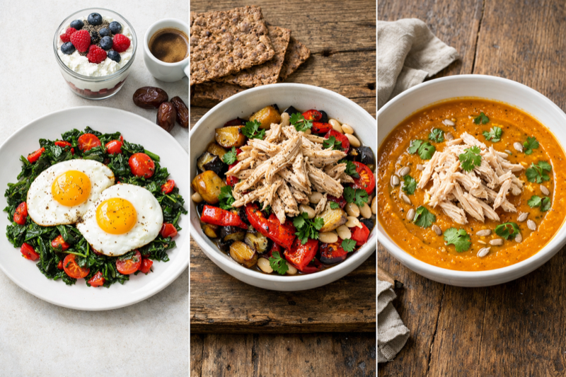
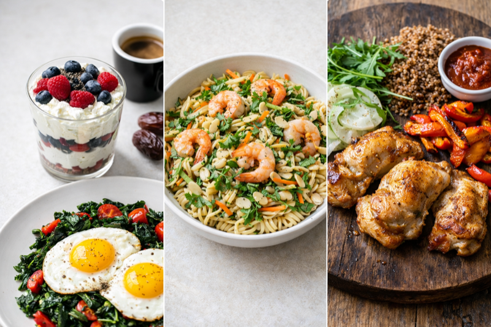
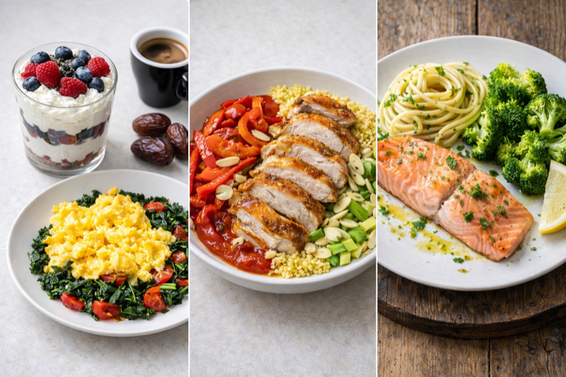
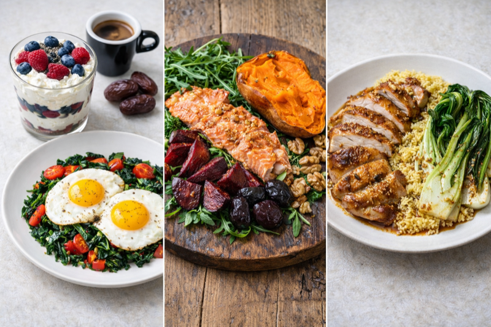
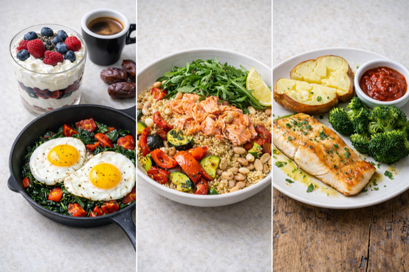
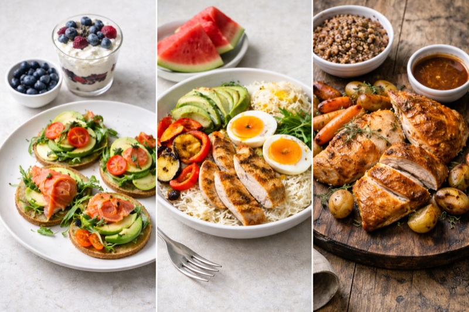
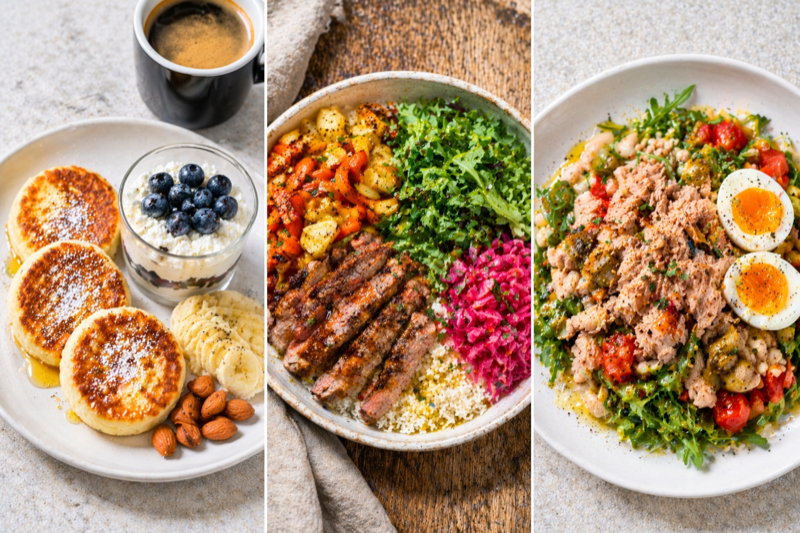

# Недельное меню — Олег

Составлено 18 апреля 2026. План откалиброван под снижение жира и сохранение мышечной массы, с учётом профиля 39 лет / 82 кг / 180 см и тренировок 5 раз в неделю. Стакан творога — ежедневный белковый якорь; ротирующийся «партнёр» меняет характер дня.

## Перейти к дню

| День | Нагрузка | ккал | Белок | Основные блюда |
|---|---|---|---|---|
| [Понедельник](#monday) | Пробежка 30 мин (натощак) | ~1955 | 172 г | Яйца с кейлом, миска с курицей и овощами, тыквенный суп с чечевицей |
| [**Вторник**](#tuesday) | Спортзал full-body (натощак) + протеин + банан | ~2025 | 186 г | Нутовые роттини с креветками, куриные бёдра с гречкой |
| [Среда](#wednesday) | Отдых — подвигаться | ~1905 | 157 г | Курица с пшеном, лосось с пастой и брокколи |
| [**Четверг**](#thursday) | Спортзал full-body (натощак) + протеин | ~2050 | 175 г | Лосось с салатом из свёклы, курица с пшеном и пак-чой |
| [Пятница](#friday) | Отдых — подвигаться | ~1895 | 158 г | Миска с консервированным лососем, треска с картофелем и брокколи |
| [**Суббота**](#saturday) | HIIT + йога (сытый) 2 ч | ~2085 | 150 г | Блины с малосольным лососем, восстановительная миска, запечённая курица |
| [**Воскресенье**](#sunday) | Бокс + HIIT (сытый) 90 мин | ~2040 | 160 г | Сырники, миска с остатками курицы, салат с белой фасолью и тунцом |

Средняя неделя: **~1994 ккал, 163 г белка в день** — выше минимума 150 г, в пределах 2 % от цели 1960 ккал.

## Якорный завтрак (большинство дней)

**Стакан с творогом** = 200 г MC Dairy прессованный творог + 100 г греческого йогурта + 80 г ягод + 10 г семян чиа. Чёрный кофе (без подсластителей — финики переносятся на кофе после обеда).

**Макро якоря**: ~400 ккал, 57 г белка.

Затем — «партнёр» дня:

- **Будний день по умолчанию** — омлет из 2 яиц + обжаренные овощи (кейл / шпинат / помидоры / перец). ~180 ккал, +14 г белка.
- **Малосольный лосось домашнего посола** (постоянная опция) — 50 г тонко нарезанного + 1 яйцо + овощи. +18 г белка.
- **Выходной сигнатурный** — субботние блины или воскресные сырники.

---

## Понедельник — лёгкая пробежка, овощной обед и ужин

### Завтрак — по умолчанию (якорь + тарелка с яйцами)

| Ингредиент | Порция | ккал | Белок |
|---|---|---|---|
| Стакан с творогом (якорь) | 200 + 100 + 80 + 10 г | 398 | 57 г |
| Чёрный кофе (без фиников) | 1 чашка | 5 | 0 г |
| 2 яйца + обжаренные овощи | 2 + 150 г | 180 | 14 г |
| **Итого** | | **~585** | **~71 г** |

### Перекус в середине утра — 1 яблоко (~80 ккал)

### Обед — миска с курицей (из остатков) и финскими ржаными хлебцами

| Ингредиент | Порция | ккал | Белок |
|---|---|---|---|
| Остатки запечённой курицы (разобранной) | 120 г | 200 | 32 г |
| Запечённый баклажан | 200 г | 50 | 2 г |
| Запечённый красный перец | 150 г | 45 | 2 г |
| Белая фасоль (консервированная) | 150 г | 160 | 10 г |
| Запечённый чеснок + петрушка | 5 зуб. + 15 г | 25 | 1 г |
| Финские ржаные хлебцы | 2 | 80 | 3 г |
| Оливковое масло Extra Virgin | 1 ч. л. | 40 | 0 г |
| **Итого** | | **~600** | **~50 г** |

### Кофе после обеда — чёрный + 2–3 финика Меджул (~65 ккал)

### Ужин — тыквенный крем-суп с красной чечевицей и разобранной курицей

| Ингредиент | Порция | ккал | Белок |
|---|---|---|---|
| Тыква + лук + чеснок + чечевица + томатная паста | — | 330 | 19 г |
| Разобранная куриная грудка (сверху) | 100 г | 165 | 31 г |
| Семена подсолнуха + кинза + оливковое масло | 15 + 10 г + 1 ч. л. | 135 | 3 г |
| **Итого** | | **~630** | **~53 г** |

**Итог дня: ~1955 ккал · 174 г белка · 52 г жиров · 207 г углеводов** ✓

[↑ Наверх](#top)

---

## Вторник — тяжёлый спортзал + сывороточный протеин (день «заслуженного десерта»)

### 6:00 спортзал (натощак) → 7:00 после тренировки: сывороточный протеин + креатин + банан

| Ингредиент | Порция | ккал | Белок |
|---|---|---|---|
| ON Gold Standard Whey | 1 мерная ложка | 120 | 24 г |
| Креатин моногидрат | 5 г | 0 | 0 г |
| Банан (в блендере) | 1 средний | 90 | 1 г |
| **Итого** | | **~210** | **25 г** |

### Завтрак — по умолчанию (якорь + яйца) → как в понедельник, ~585 ккал, 71 г белка (без фиников — они после обеда)

### Обед — нутовые роттини с креветками и капустой

| Ингредиент | Порция | ккал | Белок |
|---|---|---|---|
| Нутовые или чечевичные роттини (сухие) | 80 г | 280 | 18 г |
| Креветки EZ-peel замороженные | 130 г | 150 | 32 г |
| Капуста (тушёная) + морковь + петрушка | 100 + 50 + 20 г | 50 | 1 г |
| Миндаль + оливковое + масло авокадо | 10 г + 2 ч. л. | 140 | 2 г |
| **Итого** | | **~620** | **~53 г** |

### Ужин — куриные бёдра + гречка + запечённые овощи + томатный соус

Заготовка дня 1: курица на 3 приёма (→ обед среды, ужин четверга). Заготовка гречки на 2 дня (→ альтернативный завтрак в среду).

| Ингредиент | Порция | ккал | Белок |
|---|---|---|---|
| Куриные бёдра без кости | 120 г | 230 | 26 г |
| Гречка (сухая) | 60 г | 200 | 7 г |
| Сладкий перец + дайкон + руккола + соус + оливковое масло | — | 120 | 4 г |
| **Итого** | | **~550** | **~37 г** |

**Итог дня: ~2025 ккал · 186 г белка · 61 г жиров · 197 г углеводов** ✓
День «заслуженного десерта» (+~300 ккал по желанию).

[↑ Наверх](#top)

---

## Среда — ДЕНЬ ОТДЫХА (больше шагов)

### Завтрак — по умолчанию, ~585 ккал, 71 г белка (плюс отдельно: кофе + 2–3 финика после обеда, ~65 ккал)

### Обед — куриные бёдра (день 2 заготовки) + пшено + перец / сельдерей / кольраби + томатный соус + миндаль

~625 ккал, 43 г белка.

### Ужин — лосось Costco (день 1 заготовки) + паста + брокколи + петрушка

~635 ккал, 43 г белка. Омега-3 сегодня **не принимать** — лосось покрывает.

**Итог дня: ~1905 ккал · 157 г белка · 73 г жиров · 159 г углеводов.** День отдыха. Десерт не положен (правило для дней без тренировок). **Цель шагов: 10–12 тыс.** (как минимум 3 прогулки после еды).

[↑ Наверх](#top)

---

## Четверг — тяжёлый спортзал + сывороточный протеин (день «заслуженного десерта»)

### 7:00 после тренировки: сывороточный протеин + креатин (~120 ккал, 24 г белка)

### Завтрак — по умолчанию, ~585 ккал, 71 г белка (плюс отдельно: кофе + 2–3 финика после обеда, ~65 ккал)

### Обед — лосось Costco (день 2 заготовки) + запечённый батат + салат из запечённой свёклы с черносливом, грецким орехом и рукколой

~690 ккал, 38 г белка.

### Ужин — куриные бёдра (день 3, последний) + пшено + пак-чой + соевый соус + кунжут (азиатский профиль)

~460 ккал, 35 г белка.

**Итог дня: ~1915 ккал · 168 г белка · 69 г жиров · 170 г углеводов.** День «заслуженного десерта».

[↑ Наверх](#top)

---

## Пятница — ДЕНЬ ОТДЫХА (больше шагов)

### Завтрак — по умолчанию, ~585 ккал, 71 г белка (плюс отдельно: кофе + 2–3 финика после обеда, ~65 ккал)

### Обед — консервированный дикий лосось + белая фасоль + киноа / гречка + запечённые овощи (воскресная заготовка) + руккола

~560 ккал, 40 г белка.

### Ужин — дикая треска ИЛИ морской окунь + запечённый картофель + брокколи + томатный соус

~435 ккал, 47 г белка.

**Итог дня: ~1895 ккал · 158 г белка · 46 г жиров · 175 г углеводов.** День отдыха. **Принять 2–3 капсулы омега-3** (без лосося в меню). Цель шагов 10–12 тыс.

[↑ Наверх](#top)

---

## Суббота — пиковая тренировка (HIIT + йога 2 ч)

### Завтрак — сигнатурный выходной: блины из зелёной гречки

(На день блинов — 100 г творога в стакане вместо 200 г, чтобы не перебрать белок. Если блины «не заходят» — можно по умолчанию.)

Блины (3 шт., из замоченной на ночь зелёной гречки) + 50 г малосольного лосося + ½ авокадо + помидор + шалот + руккола + голубика.

С уменьшенным якорем: ~720 ккал, 35 г белка.

### Обед — восстановительная миска после тренировки (замена пиццы)

Рис / крупа + яйца или белок с прошлого дня + авокадо + запечённые овощи + квашеная капуста + арбуз. ~785 ккал, 44 г белка.

### Ужин — запечённая курица целиком (неделя 1 из ротации 4 вариантов)

Запечённая курица с корнеплодами. Порция Олега: 180 г курицы + 200 г овощей + 60 г крупы. ~580 ккал, 50 г белка.

*Даёт ~500 г готового мяса → хватит на обед понедельника (120 г) + обед воскресенья (150 г) + запас.*

**Итог дня: ~2085 ккал · 129 г белка · 65 г жиров · 190 г углеводов.** Белок ниже минимума 150 — добавить творог к блинам или йогурт с ягодами днём, чтобы добрать. День «заслуженного десерта».

[↑ Наверх](#top)

---

## Воскресенье — пиковое сжигание (бокс + HIIT 90 мин) + недельная заготовка

### Завтрак — сигнатурный выходной: сырники (частичная замена — 100 г творога в стакане вместо 200)

3 сырника (150 г творога + 1 яйцо + 15 г рисовой муки + 3 финика) + греческий йогурт + голубика + банан + миндаль. С уменьшенным якорем: ~600 ккал, 63 г белка.

### Обед — миска с остатками курицы с субботнего жаркого

150 г курицы + крупа + зелень + овощи. ~650 ккал, 50 г белка.

### Ужин — салат с белой фасолью и тунцом (1 раз в неделю; без нори)

Консервированный тунец (130 г) + белая фасоль + варёное яйцо + зелёные оливки + помидор + руккола + оливковое масло. ~420 ккал, 47 г белка.

### По желанию — Нью-Йоркский чизкейк (заслуженный десерт, ~320 ккал, после обеда, не после ужина)

**Итог дня: ~2040 ккал · 160 г белка · 59 г жиров · 164 г углеводов** (с чизкейком) ✓

[↑ Наверх](#top)

---

## Недельная заготовка

- **Воскресенье после полудня** — запечь баклажан / перец / чеснок / тыкву / свёклу / картофель; сварить 4 яйца вкрутую; засолить 300 г свежего лосося; замочить 150 г гречки на вторник.
- **Вторник вечером** — запечь 400 г куриных бёдер (на 3 приёма); сварить 150 г гречки + 120 г пшена.
- **Среда вечером** — запечь 300 г лосося (на 2 приёма).
- **Суббота после полудня** — запечь целую курицу (неделя 1 из ротации); разобрать на воскресный обед + на понедельник.

## Ежедневные добавки

- **Завтрак** — мультивитамин + витамин K2 (+ креатин 5 г в нетренировочные дни — добавить в йогурт)
- **После тренировки (вт / чт)** — сывороточный протеин + креатин 5 г + банан
- **Дни без лосося** (пн, пт, иногда сб / вс) — 2–3 капсулы омега-3 с едой
- **Перед сном** — магний
- **По ситуации** — витамин C 1000 мг (в дни простуды или высокого стресса)

## Гидратация

- База **2,5 л в день**; тренировочные дни (вт / чт / сб / вс) **3,0–3,5 л**.
- Температура не важна — тёплая вода с лимоном / лаймом утром подходит (пить через трубочку, прополоскать рот).
- Электролиты только в субботний HIIT / воскресный бокс или в жару.
- Прекратить пить ~1–2 ч до сна.

[↑ Наверх](#top)
